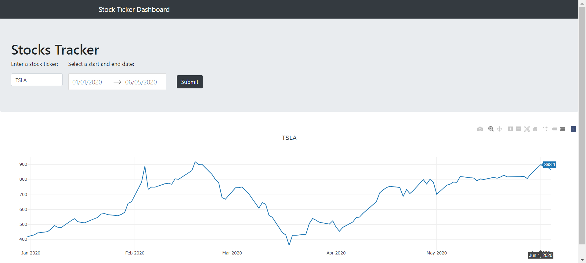
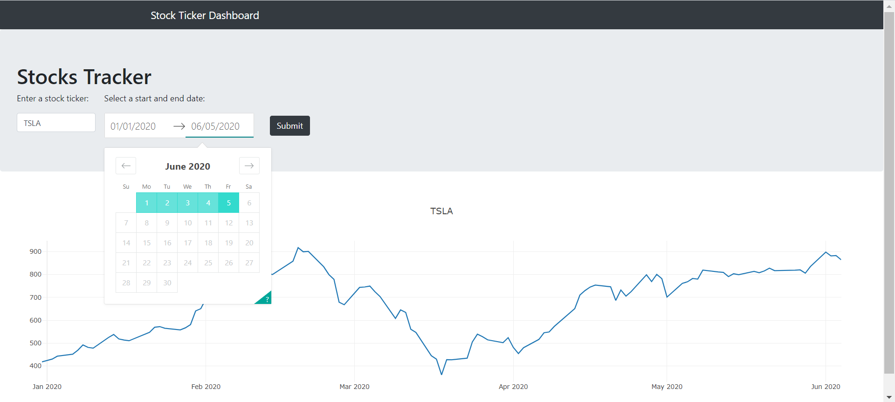

# Stock Ticker Dashboard with Plotly and Dash
 
This is a simple dashboard to display the stock prices graph for a given stock ticker and date range. 

I have made use of the python package Plotly and Dash to create this web application. In addition, I also made use of some bootstrap components to beautify the dashboard. The stock information data is taken via the Yahoo API using the pandas_datareader. 

Users have to input the stock ticker and select a date range to see. Upon clicking on the submit button, the stock price graph will be shown.

<b>Dashboard Overview:</b>

<b>Select the date range:</b>

